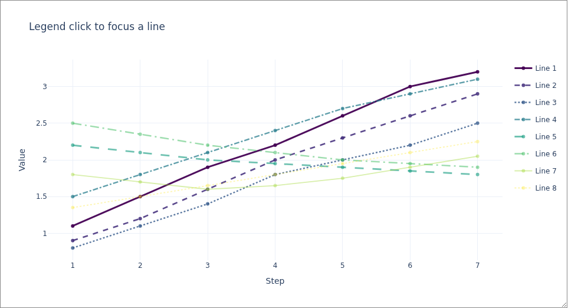
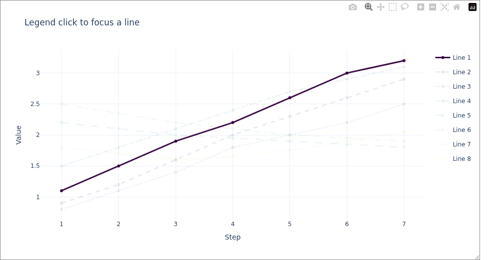

# plotlyjs-extras

Better interactive Plotly figures for Jupyter notebooks.

## Features

- **Resizable containers** — drag the bottom-right corner to resize, Plotly auto-relayouts to fill.
- **Legend-highlight** — clicking a legend entry dims all other traces and darkens the selected traces instead of hiding anything. Click again to restore.
- **No accidental hide-all** — double-click on legend is suppressed.

## Before/after preview

| Before click | After click |
|---|---|
|  |  |
| _Default view_ | _After clicking first legend item (others dimmed, active darkened)_ |

## Install

```bash
pip install git+https://github.com/graphcore-research/plotlyjs-extras.git
```

## Usage

```python
import plotly.graph_objects as go
from plotlyjs_extras import show_resizable

fig = go.Figure()
fig.add_trace(go.Scatter(x=[1,2,3], y=[4,5,6], name="A", legendgroup="A"))
fig.add_trace(go.Scatter(x=[1,2,3], y=[6,5,4], name="B", legendgroup="B"))

show_resizable(fig, width="100%", height="500px", dim_opacity=0.1, active_darken=0.2)
```

## Example notebook

- Local notebook: [`examples/legend_highlight_demo.ipynb`](examples/legend_highlight_demo.ipynb)
- Colab: [](https://colab.research.google.com/github/graphcore-research/plotlyjs-extras/blob/main/examples/legend_highlight_demo.ipynb)

### Parameters

| Parameter | Default | Description |
|-----------|---------|-------------|
| `fig` | — | Plotly `Figure` to display |
| `width` | `"100%"` | CSS width of the container |
| `height` | `"500px"` | CSS height of the container |
| `dim_opacity` | `0.1` | Opacity for non-selected traces |
| `active_darken` | `0.2` | Blend selected trace colors toward black |

## How it works

The figure is rendered as HTML via `fig.to_html()` inside a `<div>` with `resize: both`.
A small `<script>` block:
1. Waits for Plotly to finish initializing (`gd._fullData` polling).
2. Attaches a `ResizeObserver` to keep the plot filling the container.
3. Overrides `plotly_legendclick` to toggle opacity instead of visibility.
4. Suppresses `plotly_legenddoubleclick`.

## Developers

### Setup

```bash
pip install -e .[dev]
```

### Tests

```bash
pytest -q
pytest -q tests/test_notebooks.py
```

### Refresh README screenshots

```bash
python -m playwright install chromium
python scripts/generate_readme_screenshots.py
```

Outputs:
- `docs/assets/legend-before-click.png`
- `docs/assets/legend-after-click.png`

## License

MIT
